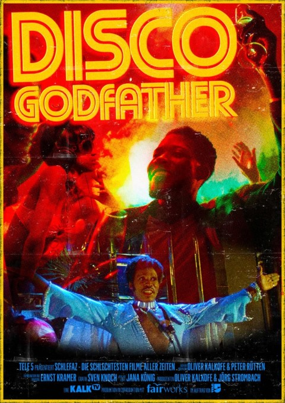

# Disco Godfather

**Late Blaxploitation-Horror-Drogen-Disco-Ghettodrama!**  
_Freitag, 27. August_

Der SchleFaZ-Jubiläums-Film zur 125. Sendung: Olli und Päter haben den 70er-Jahre Streifen Disco Godfather zum Jubiläumsfilm erkoren.

“Eigentlich hatte der Film mich schon beim fantastischen Titel Disco Godfather – und zum Glück hält der Streifen auch alles, was der Titel verspricht”, freut sich Oliver Kalkofe auf das Jubiläum sowie das gemeinsame Live-Erlebnis: “Disco Godfather ist ein Event-Film, eine echte Trash-Perle, mit der man eine richtige Party feiern kann. Ich war innerhalb von einer Minute schockverliebt in den Streifen. Wir werden 1970er-Jahre Blaxploitation de luxe erleben, mit irrwitzigen Tanz-Szenen und Disco-Kostümen, dazu aber auch jede Menge Action und den gewohnten SchleFaZ-Wahnsinn.” Oder wie es der Disco-Godfather höchstpersönlich sagt: „Schmeißt Euch voll hinein, schmeißt Euch voll hinein, schmeißt Euch voll hinein!“