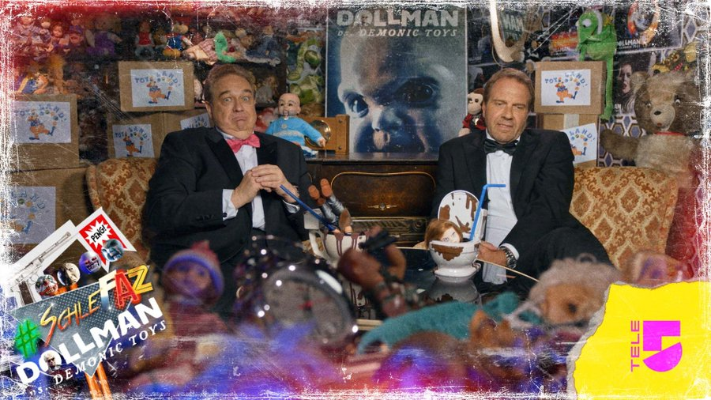

### Dollman vs. Demonic Toys

**Ein grandios vergeigtes Sequel zu unserem alten SchleFaZ-Klassiker DOLLMAN**  
_Freitag, 06. Oktober_

Spannung, Spiel und Scheissfilm!  
Drei Dinge auf einmal?  
Das geht nun wirklich nicht! DOCH.

Atmosphärisch dicht und belastend inszeniert, wirkt die skurrile Story eher konstruiert und effekthascherisch. Rüde Dialoge, Zwischenschnitte von hämisch grinsenden Puppengesichtern und veräußerlichend spannungssteigernde Musik verstärken diesen Eindruck.  
(Filmdienst)

#### KLEIN ABER OHO – STECK DEN KOPF INS KLO!

- **GESCHMACK Kategorie:** fruchtig - süß 
- **Dekoration:** Sternfrucht  
- **Glas:** Longdrinkglas 0,3 l  

**Zutaten**: 
- 4cl Jägermeister
- 3cl Licore 43 (Vanille Likör)
- 1cl Waldmeistersirup
- 15cl Maracujasaft

**Zubereitung:** 
1. Shaker mit Eiswürfeln und den Zutaten befüllen
2. kräftig shaken, auf Eiswürfeln ins Longdrinkglas abseihen

**Trinkspruch:**
>Was macht mächtig mega vollstramm?  
Unser Cocktail... der is doll, Mann!

**Trinkspiel:** 
>Der KLEIN ABER OHO – STECK DEN KOPF INS KLO! ist immer dann zur alkoholischen Deeskalation einzunehmen, wenn auf dem Bildschirm ein **Akt der Aggression oder Gewalt ausgeübt wird.**  
_Bei Schlag und Schieß – ein Drink for Peace!_  
Oder auch:  
_Wenn andere kämpfen oder raufen, lasst uns für den Frieden saufen! Denn statt zu morden und zu töten, woll’n wir uns lieber einen löten!  
Proooost SchleFaaaaaaZ!_