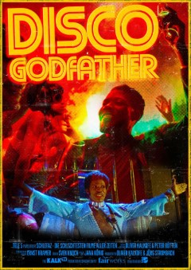
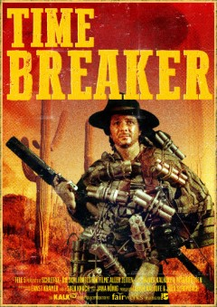

# SchleFaZ Abschlussjahr 2023
1. [Sendetermine](#sendetermine)
   1. [Abschlussstaffel](#SchleFaZ-Abschlussstaffel-2023)
   1. [Adventsstaffel](#SchleFaZ-Adventsstaffel-2023)
   1. ["Good-Bye #SchleFaZ"](#Letzte-Folge)
2. [Folgen](#Folgen)
 
## Sendetermine

### SchleFaZ Abschlussstaffel 2023

Sendetermin | Nr. | Titel | Jahr | IMDb | Cocktail
----------- | --- | ----- | ---- | ---- | --------
29.09.2023 22:00 | 1?? | [Im Reich der Amazonen](#Im-Reich-der-Amazonen) | 1986 | [⭐4.3](https://www.imdb.com/title/tt0090627/) | AMAZONS PRIME – IT’S BUTT AND BOOBFEST-TIME
06.10.2023 22:00 | 1?? | [DOLLMAN VS DEMONIC TOYS](#DOLLMAN-VS-DEMONIC-TOYS) | 1993 | [⭐4.3](https://www.imdb.com/title/tt0106743/) | tba
13.10.2023 22:00 | 1?? | [DEATHSPORT](#DEATHSPORT) | 1978 | [⭐4.1](https://www.imdb.com/title/tt0077414/) | tba
20.10.2023 22:00 | 1?? | [BEAST YOU!](#BEAST-YOU) | 1988 | [⭐4.9](https://www.imdb.com/title/tt0096142) | tba
27.10.2023 22:00 | 1?? | [YETI](#YETI) | 1977 | [⭐4.3](https://www.imdb.com/title/tt0076937) | tba

### SchleFaZ Adventsstaffel 2023

Sendetermin | Nr. | Titel | Jahr | IMDb | Cocktail
----------- | --- | ----- | ---- | ---- | --------
01.12.2023 22:00 | 1?? | tba | tba | ⭐tba | tba
08.12.2023 22:00 | 1?? | tba | tba | ⭐tba | tba
15.12.2023 22:00 | 1?? | tba | tba | ⭐tba | tba
22.12.2023 22:00 | 1?? | tba | tba | ⭐tba | tba

### Letzte Folge
Sendetermin | Nr. | Titel | Jahr | IMDb | Cocktail
----------- | --- | ----- | ---- | ---- | --------
31.12.2023 ??:00 | 1?? | "Good-Bye #SchleFaZ" | tba | ⭐tba | tba

## Folgen
### Disco Godfather

**Late Blaxploitation-Horror-Drogen-Disco-Ghettodrama!**  
_Freitag, 27. August_

Der SchleFaZ-Jubiläums-Film zur 125. Sendung: Olli und Päter haben den 70er-Jahre Streifen Disco Godfather zum Jubiläumsfilm erkoren.

“Eigentlich hatte der Film mich schon beim fantastischen Titel Disco Godfather – und zum Glück hält der Streifen auch alles, was der Titel verspricht”, freut sich Oliver Kalkofe auf das Jubiläum sowie das gemeinsame Live-Erlebnis: “Disco Godfather ist ein Event-Film, eine echte Trash-Perle, mit der man eine richtige Party feiern kann. Ich war innerhalb von einer Minute schockverliebt in den Streifen. Wir werden 1970er-Jahre Blaxploitation de luxe erleben, mit irrwitzigen Tanz-Szenen und Disco-Kostümen, dazu aber auch jede Menge Action und den gewohnten SchleFaZ-Wahnsinn.” Oder wie es der Disco-Godfather höchstpersönlich sagt: „Schmeißt Euch voll hinein, schmeißt Euch voll hinein, schmeißt Euch voll hinein!“

Links:  
[Movie Page](https://www.schlefaz.de/blog/der-125-schlefaz-disco-godfather/)  
[Cocktail Page](https://www.schlefaz.de/mediathek/disco-godfather/#cocktail)  
[Youtube: SchleFaZ 125 “Director’s Cut”](https://www.youtube.com/watch?v=bHZoYFVqUds)  
[Mediathek](https://www.schlefaz.de/mediathek/disco-godfather/)

## Sloane – Die Gewalt im Nacken

_(Sloane) USA 1985, Action_ 
_Freitag, 3. September_  
Regie: _Dan Rosenthal und Richard Belding_ Drehbuch: _Auberey K.Rattan_ Darsteller: _Robert Resnick, Debra Blee, Raul Aragon,Victor M. Ordoñez Fides u.v.a._

**Cool Guy macht Nutten und Gangster platt!** 

Von Peter Rütten:  
> Philllip Sloane war der beste Mann einer Spezialeinheit in Vietnam, ein eiskalter Einzelkämpfer und hervorragender Hubschrauber-Pilot. Jetzt läßt er sich als hochbezahlter Söldner für heiße Jobs anheuern. Der Millionär Tracy beauftragt ihn, seine Tochter Janice wiederzufinden, die in Manila verschwunden ist. Sloane findet bald heraus, daß hinter der Entführung Chan Se, der Boss einer asiatischen Gangster-Organisation steckt. Eine Höllenjagd von dem Großstadsumpf Manilas bis in die Tiefen des philippinischen Dschungels beginnt…

Jede Minute dieses Films ist mit schrill waberndem Wahnsinn durchtränkt! Ein Film wie ein Fieberrausch – als hätte man sich einen Liter Absynth heiß gemacht, ein Kilo Zucker drin aufgelöst und das Ganze dann ge-ext!

Im Mutterland von Rambo, Braddock, American Ninja und Co. erschien dieser Film nur auf VHS. In Deutschland aber (und selbst in der Türkei!) lief er in Kino! Jetzt endlich auch bei SchleFaZ!

Links:  
[Mediathek/Movie Page](https://www.schlefaz.de/mediathek/sloane/)  
[Cocktail Page](https://www.schlefaz.de/blog/sloane-das-rezeptkaertchen/)

## Time Breaker

**Ranziges Geflecht aus alten Western- und Fantasyfilm-Kötteln!**  
_Freitag, 10. September_

Oberflächlich eine kaum verhohlene Kopie von Clint Eastwoods Leone-Western inspiriert dieser Schlefaz dazu, sich den ganz großen philosophischen Fragen zu stellen: Was ist Realität? Was ist Objektivität? Was sind Fakten? Was sind kausale Zusammenhänge? Logiklöcher, Verwirrung, Widersprüche – dieser Film zeigt: Es ist alles Ansichtssache. 

Nur eines hält Time Breaker konsequent durch: die Zeichnung ALLER Figuren als blöde Arschlöcher.

Links:  
[Mediathek/Movie Page](https://www.schlefaz.de/mediathek/time-breaker/)  
[Cocktail Page](https://www.schlefaz.de/mediathek/time-breaker/#cocktail/)

## Angriff der Riesenkralle

**Ein halbes Hähnchen gibt die Killer-Krähe!**  
_Freitag, 17.September_

Phänomenaler Monsterfilm aus der frühen Blütezeit der Science Fiction, als man noch keine billigen Farbeffekte benötigte, um das Publikum in seinen Bann zu ziehen! SchleFaZ präsentiert ein furioses Flugmonster, das eigentlich von Effekt-Legende Ray Harryhausen designt und animiert werden sollte. Der war allerdings zu teuer, weswegen man einfach einem alten Marionettenschnitzer aus Mexiko 50 Dollar in die Hand drückte, um ihm dafür eine Riesenkralle zu basteln! Die daraus resultierende behämmerte Bachstelze wurde bei der offiziellen Premiere vom Publikum auch direkt schallend ausgelacht wurde – und nicht nur die Darsteller verließen so schnell und unauffällig wie möglich das Kino.

Nicht so wir SchleFaZianer! Wir kosten den Film bis zur letzten Sekunde aus!

Links:  
Movie Page: _missing_  
Cocktail Page: _missing_

## Das Söldnerkommando

**Kapitale Kampfkunst-Prügel-Action!**  
_Freitag, 24. September_

Der Film ist zwar von 1982, steckt aber noch knietief im Morast der 1970er: die Porno-Disco-Funk-Mucke, die Schlaghosen, die Pimp-Anzüge, die dicken Karren etc. pp. Wenn man jedoch Kampfkunst, geile Seventies-Karren und Stunts liebt, kann dieser SchleFaZ der Beste aller SchleFaZze werden – der Rest (Story etc.) besticht von der Machart durch sehr liebenswerte, weil absolut vollkommener Ahnungslosigkeit.

Das hat Charme, das ist einfach saulustig!

Links:  
Movie Page: _missing_  
Cocktail Page: _missing_  

## Humanoide – Kampf um die 5. Galaxis

**Grenzdebiler Italo-Star-Wars-Kopisten-Kracher!**  
_Freitag, 1. Oktober_

Ein sehr viel fauleres und lahmeres Star-Wars-Ripoff als unser Star Crash! Aber immerhin waren sie beim Titel so fair, keine Star Wars-Referenz einzubauen. Warum auch immer. Eigentlich komplett idiotisch, wenn man alles darauf anlegt, Star-Wars-Fans anzulocken/abzuzocken, und dann keine Referenz im Titel einzubauen.

Special Effects Supvervisor Antionio Margheriti garantiert: Das KANN KEIN GUTER FILM SEIN! Da mögen jetzt noch so sehr Bond-Beißer Richard Kiel oder Beatle-Braut und Busen-Bomber Babsi Bach mit herumturnen – DAS IST KEIN GUTER FILM, allein aufgrund der Tatsache, dass irgendjemand es für eine gute Idee hielt, die Flachpfeife Margheriti (siehe auch unser SchleFaZ Perry Rhodan – SOS aus dem Weltall) zu engagieren.

Links:  
Movie Page: _missing_  
Cocktail Page: _missing_

## Rise of the Animals

**Apocalypse Wau – Die digitale Dünpfiff-Dusche!**  
_Freitag, 8. Oktober_

Auch dieser Film ist wirklich schlecht, aber: Angesichts des Budgets von 7.000 Dollar ist dieses Werk schon wieder unterhaltsam. Chris Wojcik machte den Film als Senior Project, als er an der Filmschule war: Er konnte das Filmequipment der Schule nutzen. Trotzdem: Es wird erzählt, dass selbst Kult- und Trashfilmfestivals diesen Film abgelehnt haben, weil die Effekte zu schlecht waren und dass die Produktion von „Good Weather“ und „Good Luck“ geprägt war. Nicht auszudenken, was bei schlechtem Wetter bei der ganzen Sache herausgekommen wäre!

Die Darsteller sind in ihren expressiven Mitteln durchweg sehr limitiert, aber alle sind mit Enthusiasmus dabei – und das zählt am Ende des Tages. Am Ende entstand ein absolut solides Roadmovie, von dem man – obwohl völlig unbegründet – den Eindruck gewinnen kann, es habe auch eine innere, emotionale Logik.

Fazit: Im Gegensatz zu nahezu allen Asylum-Filmen, die gegenüber „Rise…“ geradezu astronomische Budgets hatten, kann man sich bei diesem Film wirklich ein bisschen amüsieren. Ein Hoch auf den jugendlichen Enthusiasmus, der durch jede Einstellung schimmert!

Links:  
Movie Page: _missing_  
Cocktail Page: _missing_

## Liebesgrüße aus Fernost

_Freitag, 15. Oktober_

Es wird gemunkelt, dass Quentin Tarantino Fan des Films ist, eine persönliche Filmkopie besitzt und diese bei seinem Grindhouse Film Festival in den Nullerjahren im Double Feature mit The Female Bunch (Des Satans heiße Katzen) vorgestellt hat.

Die Jäger der verlorenen Filme zum Werk: „… hat man es mit einer Gemeinschaftsproduktion der USA mit den Philippinen zu tun, einen B-Kracher. In den 1970er-Jahren wurde das südostasiatische Inselarchipel von amerikanischen Billigfilmern geradezu überrannt, die dort für schmales Geld und einen Koffer voller Pyrotechnik ein fetziges Gute-Laune-Vehikel nach dem nächsten fabrizierten. Die Voraussetzungen waren günstig, boten die Philippinen ja eine traumhaft schöne Kulisse und Behörden, die ein Wort wie „Sicherheitsbestimmungen bei Medienproduktionen“ nicht im Ansatz buchstabieren konnten. So entstanden von halsbrecherischen Stunts durchzogene, inhaltlich zum Teil hoch abstruse Nonsens-Spektakel, denen keine Story zu dünn und keine Idee zu unsinnig erschien.“

Ein perfekter SchleFaZ, ein perfekter Abschluss der Sommerstaffel 2021!

Links:  
Movie Page: _missing_  
Cocktail Page: _missing_
